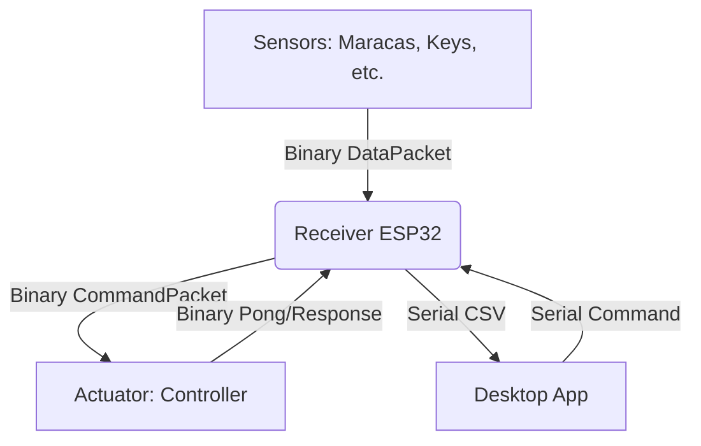

# Requirements

### Overview & Goals
Transition the wireless communication layer (ESP-NOW) from JSON-based strings to a packed binary struct protocol. This will significantly reduce packet overhead, decrease latency, and lower CPU usage for serialization/deserialization across all devices in the system.

### Scope
- **In Scope**: `receiver`, `key_instrument`, `maracas`, `rainstick`, `touch_instrument`, `vibration_detector`, and `controller`.
- **Out of Scope**: The Serial protocol between the `receiver` and the desktop application remains in its current text-based CSV format for ease of debugging and compatibility with existing desktop software.

### Functional Requirements
- **High Throughput**: Support higher sensor reading frequencies by minimizing packet size.
- **Reliability**: Ensure Discovery and Ping/Pong mechanisms work correctly with the new protocol.
- **Consistency**: Maintain a unified protocol header across all sensor types and actuators.

# Technical Design

### Current Implementation
- **Protocol**: JSON strings over ESP-NOW using `ArduinoJson`.
- **Packet Size**: Typically 70-120 bytes.
- **Overhead**: High CPU cost for string parsing and JSON object creation.

### Key Decisions
- **Raw C Structs**: Use `__attribute__((packed))` structs to map data directly to memory.
- **Fixed-Width Strings**: Use `char[N]` arrays for identifiers (device names, ports) to avoid dynamic allocation and keep packet sizes predictable.
- **Common Header**: A shared `Protocol.h` file will define the `MessageType` and packet structures to be used by all projects.

### Data Models
```cpp
// Example of the shared protocol structure
enum MessageType : uint8_t {
    MSG_DISCOVERY = 0,
    MSG_DISCOVERY_RESPONSE = 1,
    MSG_PING = 2,
    MSG_PONG = 3,
    MSG_DATA = 4,
    MSG_COMMAND = 5
};

struct __attribute__((packed)) ProtocolHeader {
    uint8_t type;
};

struct __attribute__((packed)) DataPacket {
    uint8_t type = MSG_DATA;
    char deviceName[16];
    char port[8];
    int32_t value;
};

struct __attribute__((packed)) CommandPacket {
    uint8_t type = MSG_COMMAND;
    char deviceName[16];
    char port[8];
    char command[16];
    char value[16];
};
```

### Architecture Diagram


# Delivery Steps

### ✓ Step 1: Define Binary Protocol Header
Create a shared `Protocol.h` file containing the packed struct definitions for all message types.
- Define `MessageType` enum (Discovery, Ping, Data, Command, etc.).
- Create `__attribute__((packed))` structs for each message type with fixed-size string buffers.
- Distribute this header across the `src` folders of all affected projects.

### ✓ Step 2: Implement Binary Protocol in Receiver
Update the `receiver` project to handle the new binary protocol.
- Refactor `onReceive` to cast the incoming buffer to the appropriate packet struct based on the first byte.
- Update `processIncomingPackets` to extract data from structs instead of `JsonDocument`.
- Update `sendDiscovery`, `sendPing`, and `sendToDevice` to populate and send structs.
- Ensure the Serial output (`MSG,discovery...` and `DATA,device,port,value...`) remains unchanged for desktop compatibility.

### ✓ Step 3: Update Sensor Nodes to Binary Protocol
Apply binary protocol changes to all sensor devices.
- Projects: `key_instrument`, `maracas`, `rainstick`, `touch_instrument`, and `vibration_detector`.
- Replace `ArduinoJson` serialization in `sendEvent`, `sendDiscoveryResponse`, and `sendPong` with struct population.
- Update `onDataRecv` to handle binary `discovery` and `ping` packets.
- Remove `ArduinoJson` dependency where it's no longer needed to save memory.

### ✓ Step 4: Update Actuator (Controller) to Binary Protocol
Update the `controller` project to process binary command packets.
- Refactor `onDataRecv` and `processIncomingPackets` in `controller/main.h` to use structs.
- Map the incoming `CommandPacket` fields to the `CommandManager`.
- Update `sendDiscoveryResponse` and `sendPong` to use the binary format.

### ✓ Step 5: Increase CommandPacket.value size
Increase the size of the `value` field in `CommandPacket` struct to 32 bytes to support multiple parameters.
- Update `Protocol.h` in the `receiver` project.
- Redistribute the updated `Protocol.h` to all other projects.