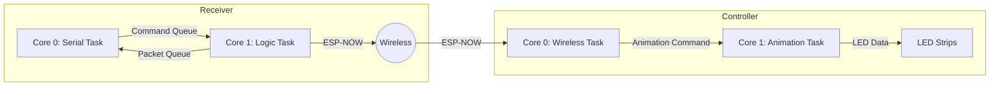

# Requirements

### Overview & Goals
Implement RTOS task separation for both the `receiver` and `controller` (actuator) as suggested in the project's `IMPROVEMENTS.md`. This will improve system responsiveness by decoupling slow/bursty I/O operations (Serial, LED animations) from time-critical networking tasks (ESP-NOW).

### Scope
- **Receiver**: Move Serial I/O to Core 0 and ESP-NOW/Logic processing to Core 1.
- **Controller**: Move Wireless communication (Pings, Command reception) to Core 0 and LED Animation/Processing to Core 1.
- **Memory Optimization**: Replace dynamic `String` buffers with static `char` arrays in the `receiver`.

### Functional Requirements
- The `receiver` must process incoming Serial commands without delaying ESP-NOW packet reception or pings.
- The `controller` must remain responsive to "Ping" and "Stop" commands even while running complex, computationally expensive LED animations.
- Memory usage should be more predictable to prevent fragmentation-related crashes.

# Technical Design

### Current Implementation
- **Receiver**: Single-threaded execution in `loop()` on a single core. Dynamic `String` usage for serial buffering.
- **Controller**: Single-threaded execution in `loop()` on a single core. LED animations and network processing share the same execution time.

### Key Decisions
- **Core Assignment (Receiver)**: 
  - **Core 0**: Serial Task. High priority for reading/writing serial data.
  - **Core 1**: Logic Task. Handles protocol logic, discovery, and pings.
- **Core Assignment (Controller)**:
  - **Core 0**: Wireless Task. Handles ESP-NOW reception and heartbeat (Ping/Pong).
  - **Core 1**: Animation Task. Dedicated to LED updates and animation math.
- **Thread Safety**: Use `std::mutex` and `std::lock_guard` for shared data (queues, device maps, flags).

### Proposed Changes

#### Receiver (`receiver/main.cpp`)
- Replace `String serialBuffer` with `char serialBuffer[256]`.
- Implement `serialTask` (Core 0) and `logicTask` (Core 1).
- Protect `discoveredDevices` with a mutex.

#### Controller (`controller/main.cpp` & `main.h`)
- Implement `wirelessTask` (Core 0) and `animationTask` (Core 1).
- Move `handlePing()` and `processIncomingPackets()` to the wireless task.
- Ensure `commandManager.update()` is decoupled from network reception.

### Architecture Diagram

# Testing

### Validation Approach
Verify that both devices function correctly after separation and that responsiveness is improved.

### Key Scenarios
- **Receiver Throughput**: Send a burst of Serial commands and verify that ESP-NOW discovery responses from other nodes are still processed and printed promptly.
- **Controller Responsiveness**: Start a complex animation (e.g., Rainbow or Comet) and verify that the device still responds to `ping` commands from the receiver.
- **Stability**: Run the system for an extended period to ensure no deadlocks or memory leaks occur due to the multi-threaded environment.

# Delivery Steps

### ✓ Step 1: Refactor Receiver: Static Buffers and String optimization
Replace dynamic `String` buffers with fixed-size `char` arrays in the `receiver` to prevent heap fragmentation.
- Update `main.cpp` in `receiver` to replace `String serialBuffer` with `char serialBuffer[256]`.
- Refactor `processSerialInput()` to use the static buffer and track length.
- Replace `String` parameters in `handleSerialCommand` and `sendDeviceCommand` with `const char*` or `const String&` to minimize allocations.

### ✓ Step 2: Implement Thread Safety: Mutexes and Queues
Introduce `std::mutex` to protect shared resources in both the `receiver` and `controller`.
- Add mutexes for `discoveredDevices` and `packetQueue` in the `receiver`.
- Add mutex for `packetQueue` and `pingReceived` flag in the `controller`.
- Ensure all accesses to these shared variables are wrapped in `std::lock_guard`.

### ✓ Step 3: Receiver: RTOS Task Separation
Create dedicated FreeRTOS tasks for Serial I/O on Core 0 and Logic/ESP-NOW on Core 1 for the `receiver`.
- Define `serialTask` for Core 0 and `logicTask` for Core 1.
- Move `processSerialInput()` to `serialTask`.
- Move `processIncomingPackets()`, `handleDiscoveryInterval()`, and `handlePingInterval()` to `logicTask`.
- Initialize tasks using `xTaskCreatePinnedToCore` in `setup()`.

### ✓ Step 4: Controller: RTOS Task Separation
Create dedicated FreeRTOS tasks for Wireless communication on Core 0 and Animation/LED processing on Core 1 for the `controller`.
- Define `wirelessTask` for Core 0 and `animationTask` for Core 1.
- Move `handlePing()` and `processIncomingPackets()` to `wirelessTask`.
- Move `commandManager.update()` to `animationTask`.
- Ensure `showAll()` (FastLED) is called within the animation task.
- Initialize tasks using `xTaskCreatePinnedToCore` in `setup()`.